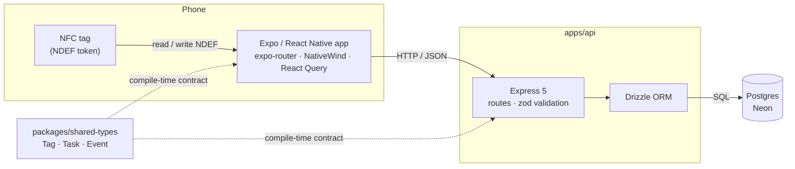
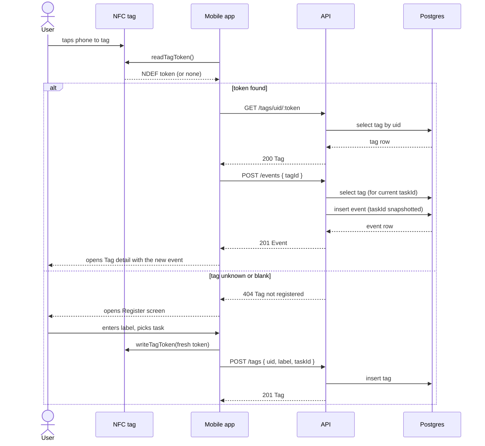
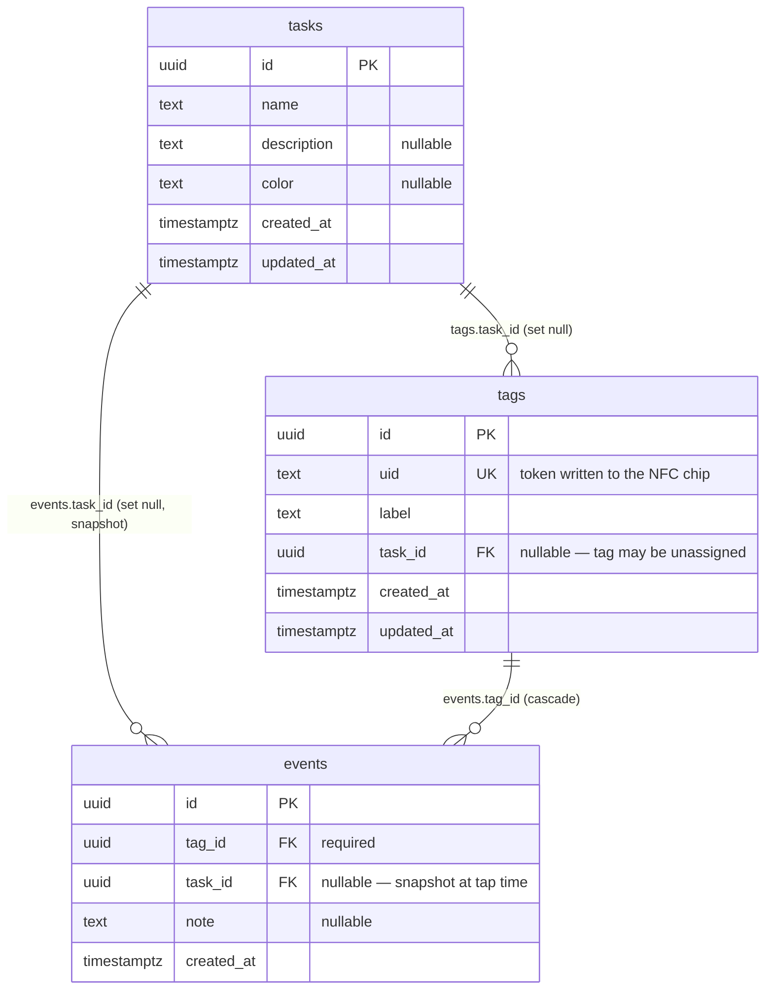

# nudge — Architecture

Tap an NFC tag, log an event, see history. The mobile app is a thin client; all
business logic, validation and persistence live in the API.

For coding conventions and day-to-day workflow, see [AGENTS.md](../AGENTS.md).
For the reasoning behind specific choices, see [decisions/](./decisions).

> Parts of this document are maintained by hand. The data model and route map
> are also generated directly from source — see
> [generated/schema.md](./generated/schema.md) and
> [generated/routes.md](./generated/routes.md), refreshed with
> `npm run docs:generate`. Where they disagree, the generated files win.

---

## System overview



**Deployment status:** the database is live on Neon. The API currently runs
locally (`npm run dev:api`); deploying it to Fly.io is planned but not done yet.
The mobile app runs through the Expo dev server, with a custom dev client
required for NFC (see [AGENTS.md](../AGENTS.md#nfc-srclibnfcts)).

### Repository layout

```txt
apps/
  api/            Express + Drizzle + Postgres
  mobile/         Expo app
packages/
  shared-types/   Tag, Task, Event — imported by both, single source of truth
docs/
  architecture.md      this file
  decisions/           ADRs
  generated/           produced by `npm run docs:generate` — do not edit
scripts/
  generate-docs.ts
```

---

## Core flow: tapping a tag

The app holds no business logic beyond reading the tag. It reads a token from
the tag's NDEF data, asks the API what that token is, and the API decides what
to record — including snapshotting which task the tag pointed at.



Two details worth knowing, both deliberate:

- **Tags are identified by a token the app writes**, not the chip's hardware
  UID — hardware UID access is inconsistent across tag types and platforms.
- **`events.task_id` is a snapshot**, copied from the tag at tap time rather
  than joined at read time, so reassigning a tag later doesn't rewrite history.

---

## Data model

Generated from the Drizzle schema — see [generated/schema.md](./generated/schema.md)
for the always-current version including column types.



Deleting a **tag** cascades to its events. Deleting a **task** sets the
referencing columns to null, so tags become unassigned and past events keep
their row while losing the task reference.

---

## API surface

Full generated list: [generated/routes.md](./generated/routes.md).

| Resource | Purpose |
| --- | --- |
| `/tags` | CRUD for registered tags, plus `/tags/uid/:uid` — the lookup the app does right after a scan, before it knows a tag's internal id. |
| `/tasks` | CRUD for the things a tag can log against. |
| `/events` | `POST` logs a tap; `GET` is the history feed, filterable by `tagId`/`taskId` and paged backwards with `before` + `limit`. |
| `/health` | Liveness check. |

Responses are JSON. Errors are `{ "error": string }` with an appropriate status,
thrown as `HttpError` and formatted by one error handler in `apps/api/src/index.ts`.

---

## Regenerating the generated docs

```bash
npm run docs:generate
```

Reads `apps/api/src/db/schema.ts` and `apps/api/src/routes/*.ts` (plus
`apps/api/src/index.ts` for mount prefixes) and rewrites `docs/generated/`.
Worth re-running whenever the schema or routes change.
