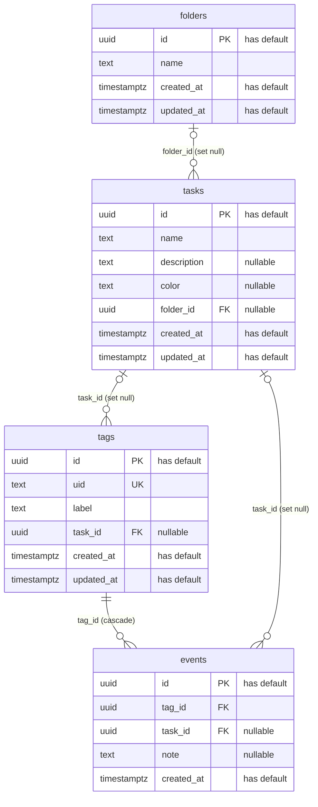

<!-- Generated by scripts/generate-docs.ts — do not edit by hand. -->
<!-- Run `npm run docs:generate` to refresh. -->

# Data model

Generated from `apps/api/src/db/schema.ts`.

## Tables

### `events`

| Column | Type | Constraints |
| --- | --- | --- |
| `id` | `uuid` | primary key, not null, default |
| `tag_id` | `uuid` | not null, → tags.id (on delete cascade) |
| `task_id` | `uuid` | → tasks.id (on delete set null) |
| `note` | `text` | — |
| `created_at` | `timestamp with time zone` | not null, default |

### `folders`

| Column | Type | Constraints |
| --- | --- | --- |
| `id` | `uuid` | primary key, not null, default |
| `name` | `text` | not null |
| `created_at` | `timestamp with time zone` | not null, default |
| `updated_at` | `timestamp with time zone` | not null, default |

### `tags`

| Column | Type | Constraints |
| --- | --- | --- |
| `id` | `uuid` | primary key, not null, default |
| `uid` | `text` | unique, not null |
| `label` | `text` | not null |
| `task_id` | `uuid` | → tasks.id (on delete set null) |
| `created_at` | `timestamp with time zone` | not null, default |
| `updated_at` | `timestamp with time zone` | not null, default |

### `tasks`

| Column | Type | Constraints |
| --- | --- | --- |
| `id` | `uuid` | primary key, not null, default |
| `name` | `text` | not null |
| `description` | `text` | — |
| `color` | `text` | — |
| `folder_id` | `uuid` | → folders.id (on delete set null) |
| `created_at` | `timestamp with time zone` | not null, default |
| `updated_at` | `timestamp with time zone` | not null, default |
